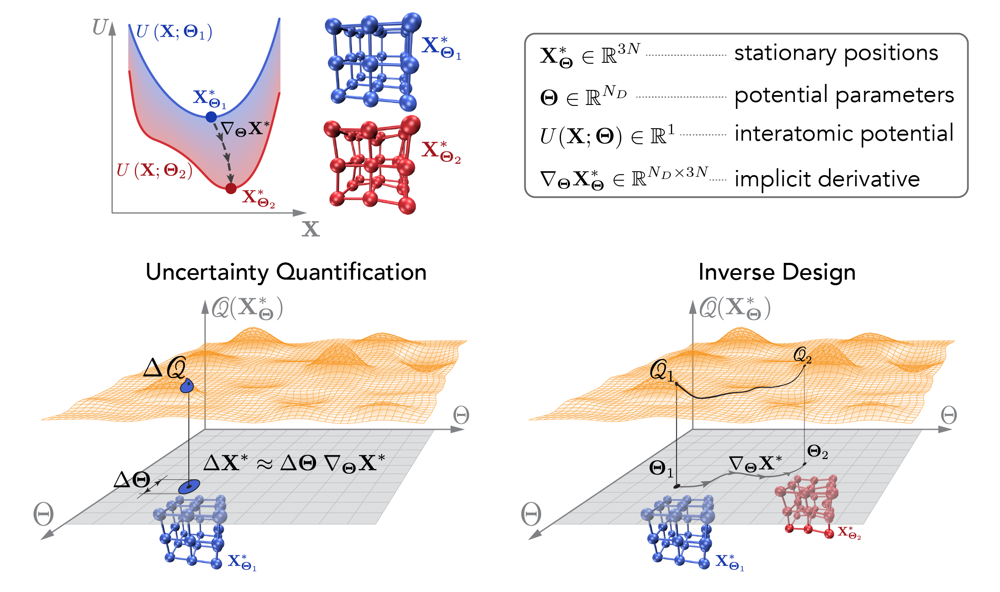

# Implicit differentiation with LAMMPS

Python implementation of implicit differentiation of stationary atomic minima positions with respect to interatomic potential parameters with LAMMPS.



For a detailed description of the formalism and derivations used in this project, please refer to the following paper:

[I. Maliyov, P. Grigorev, T.D. Swinburne, _Exploring parameter dependence of atomic minima with implicit differentiation_, arXiv:2407.02414](https://arxiv.org/abs/2407.02414)

# Supported features

* calculation of the inhomogeneous implicit derivative with inverse and sparse methods $\nabla_{\boldsymbol{\Theta}} \tilde{\mathbf{X}}^*_{\boldsymbol{\Theta}} \in \mathbb{R}^{N_D\times 3N}$
* calculation of homogeneous implicit derivative of strain (isotropic case): $\nabla_\mathbf{\Theta} \epsilon^*_\mathbf{\Theta} \in \mathbb{R}^{N_D}$
* loss minimization for inverse design applications
* support of MPI and OpenMP parallelization via LAMMPS

# Installation

## Requirements

* Before installation of the package, install `lammps` as Python module. More details [here](https://docs.lammps.org/Python_install.html).

* Optionally, install `mpi4py` for parallel MPI runs.

## Download and Install

1. Clone the GitHub repository:
```bash
git clone git@github.com:marseille-matmol/LammpsImplicitDerivative.git
```

2. Navigate to the package folder:
```bash
cd LammpsImplicitDerivative
```

3. Install with `pip`
```bash
pip install .
```

4. Import as Python package. E.g., within a Python file:
```python
from lammps_implicit_der.systems import BCC
```

# Examples

In the `./examples` folder, you will find several Jupyter notebooks that demonstrate how to use the package to compute the inhomogeneous and homogeneous implicit derivatives in different atomic systems.
The files are arranged in the recommended order for reviewing.

To clean the output files from the examples, in the `./examples` folder, run:

```bash
make clean
```

# Tests

Running tests is recommended after installation and when new implementations are made.

Navigate to the `tests` folder and run `pytest`:
```bash
cd ./tests
pytest -s -v
```

Optionally, tests can be run with MPI:
```bash
mpirun -n 8 pytest -s -v
```

Reference values for the tests are obtained from the `./tests/tests.ipynb` notebook.
